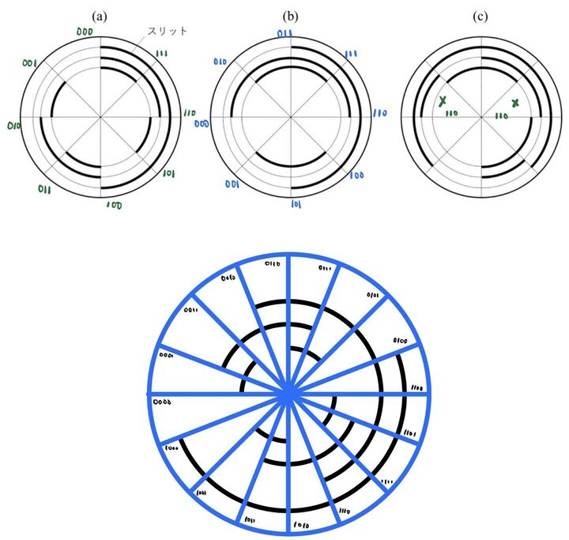
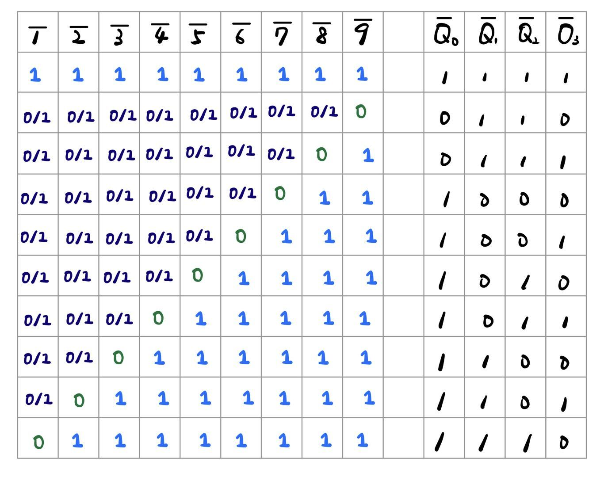

# 情報科学最終レポート

### WEI QIFENG 09C22052

## 問題 1

<div align="center"><p><font size="3" color="gray">図１</font></p></div>

### (1). スリットの開け方を工夫したコード化の仕組み：

今回のエンコーダはAbsolute encoderである。  
- Absolute encoderの回転軸に取り付けたスリット付きのディスクによって、回転角度をコード化する仕組みになっている。  
- ディスクには独自のパターンでスリットが開けられており、各スリットパターンが固有のコード値に対応している。  
- ディスクが1回転するごとに各スリットパターンがセンサーによって読み取られ、それに基づいて回転角度が一意に決定される。  
- この方式により、エンコーダが電源を切ったり、回転を停止させたりしても、再度動作する際に正確な回転角度を知ることができるのがメリット。  

### (2). (a)と(b)のディスクでのコード化：

ディスクが1回転するごとに8つの異なるスリットパターン(n*45deg)が生成され、それぞれが3ビットのグレーコードで表現される。(図１参照)  
具体的には：  
- (a)のディスクは3ビットの2進数で回転角度をエンコード。  
ディスクが1回転するごとに8つの異なるスリットパターンが生成され、それぞれが3ビットの2進数で表現されている。  
- (b)のディスクは3ビットのグレーコードで回転角度をエンコード。  
グレーコードは連続する値の間で1ビットのみが変化する特徴を持っている。  


### (3). (c)のディスクのコード化について：

(c)のディスクではスリットの配置が上手く工夫されていないため、回転角度を正確にコード化していない。  
- スリットの配置が不十分なため、同じコードが違う位置に配置されている。  
- よって、センサーが検知される信号の特異性がなくなり、角度情報を得ることができない。  
(図１参照)  

### (4). ロバスト性について：

グレーコードを使用した(b)のディスクは、グレーコードでエンコードされ、エンコードの途中で誤差が生じても1ビットの変化のみ。  
- 回転角度の変化にロバストに対応しているため、エンコーダとしての信頼性が高いと言える。  
- 一方、2進数を使用した(a)のディスクは、角度が変化する境界誤差が生じやすく、他の角度値の飛ぶことがある。  
特に高精度の角度検知が必要な場合には不適切とされる。  


### (5). 4ビットで回転角をコード化するためのスリット付きディスクの考案：

4ビットのグレーコードで回転角をコード化するためのスリット付きディスクを考案する。  
- ディスクには16個のスリットを等間隔で配置し、それぞれが1つのビットに対応する。  
- これにより、4ビットのグレーコードを実現できる。  
具体的なスリットの配置は以下のようになる  
（'1'はスリットの開口、'0'はスリットの非開口）  

スリット位置: 1111 1011 1101 1001 1100 1000 1010 1110 0100 0110 0010 0011 0001 0101 0000 0111  
グレーコード: 0000 0001 0011 0010 0110 0111 0101 0100 1100 1101 1111 1110 1010 1011 1001 1000  
(図１参照)

- ディスクが1回転するごとに、スリットのパターンが上記のグレーコード順に変化。  
- このディスクを使用すると、1回転あたり16通りの異なるスリットパターンが生成され、それぞれが4ビットのグレーコードで表現される。  
- この設計を用いることで、4ビットのグレーコードで回転角を正確にコード化することができる。  
- グレーコードは連続する値の間で1ビットのみが変化する特徴を持つため、誤差が生じても角度情報の精度を維持できるのが利点。  
- また、16通りのスリットパターンにより高い分解能を実現でき、エンコーダとしてのロバスト性も高められた。  

## 問題 2

### (1). Huffman圧縮について
- 今回扱うPPMファイルはRGB形式で四色しかない。 
- かなり高度な圧縮が期待される。 
    1. [255_255_255_]を[0_]にした場合、6（最高圧縮比）
    2. [0_0_0_]を[110_]にした場合、1.5（最低圧縮比）
    3. Header含まずの場合、圧縮率は以上の区間と想定される
- Huffman Treeで作ると[0][10][110][111]のインデックスをそれぞれ頻度によって振り分ける。

    | data | freq | code | size |
    |:--:|:--:|:--:|:--:|
    |255_255_255_255_|140|0_|12 -> 2|
    |0_0_0_|78|10_|6 -> 3|
    |255_0_0_|60|111_|8 -> 4|
    |255_255_0_|46|110_|10 -> 4|

    | orig size | encoded size |
    |:--:|:--:|
    |12x140 + 6x78 + 8x60 + 10x46|2x140 + 3x78 + 4x60 + 4x46|
    |3088|938|
    

    基づいて、データ部分のみを考える場合は  
    「3088 -> 938」の圧縮が実現できる(圧縮率3.29)。

- デコードのため、新たなテキストでまず画像サイズと対応関係をHeaderに書き込み、インデックスとピクセル情報を書き込む必要がある。
- しかし今回の二進数ははTXT形式（ASKII）で表しているため、実際二進数で保存されるとさらに小さくなる。
- 今回のプログラムは便利上、スペースを保留した、実際ではHuffman Treeの仕組みによりスペースを保存しなくても正しくデコードでき、さらなる圧縮が期待できる。

<div align="center"><p><font size="3" color="gray">図２(further_test.ppm and Q2.ppm)</font></p></div>


### (2/3)Program説明
できるだけ汎用のあるプログラム作成した、具体的には以下となる。

- 4色の画像だけでなく、最大100000色まで対応可能
- さらに大きいサイズでも対応可能
- (7869色・256x256で検証済み)(図２)
- GrayScaleは対応不可（P3 Only）
- (ピクセル数が3の倍数の場合は対応可能だが圧縮率は良くないと想定)

プログラムの流れは以下となる

#### encode.c  
1. 画像ファイルを読み取る
2. 画像のRGBの種類（色）を取り出す
3. それぞれの色の頻度をカウント
4. 頻度と色でHuffmanTree・インデックスを作成
5. 新たのファイル(step1.txt)でHeaderを作り、画像サイズ・RGBとインデックスを書き込む
6. 元画像のRGBを読み取り、変換されたインデックスをstep1.txtに書き込む
7. step1.txtのサイズ及び圧縮率をPrint
8. さらにstep1.txtに対してRL法（Headerは保持）（step2.txtに出力）
9. step2.txtのサイズ及び圧縮率をPrint

#### decode.c 
1. step2.txtを読み込む
2. RL法の逆過程を行う（Headerは保持）（decode_step1.txtに出力）
3. Headerを使いインデックスをRGBに戻す
4. decoded.txtサイズをPrint

### (2/3)Program Output・圧縮率
```
[With the Q2.ppm]
The original ppm file is: 3140 bytes
Total colors: 4
The encoded file(using Huffman) is: 995 bytes
(Compression rate: 3.1558)
The encoded file(using Huffman+RL) is: 573 bytes
(Compression rate: 5.4799)

[さらに大きい画像で実験]
[With the further_test.ppm]
The original ppm file is: 760829 bytes
Total colors: 7869
The encoded file(using Huffman) is: 495533 bytes
(Compression rate: 1.5354)
The encoded file(using Huffman+RL) is: 415712 bytes
(Compression rate: 1.8302)
```

参考：  
A. Huffman, "A method for the construction of minimum-redundancy codes", Proceedings of the I.R.E., Sept. 1952, pp. 1098-1102

## 問題 3

### (1). 74LS147と7447について：
- 74LS147は10進数をBCD（バイナリコード化十進数）に変換する優先エンコーダーのIC
- 0から9までの数字が選択されると、その数字をBCD形式にエンコードする。
- このエンコーダーは負論理を使用し、選択された数字は低電圧（L）、選択されていない数字は高電圧（H）で表す。
- 負論理のため74LS147の出力もnegative logicのためNotを通す。
- 7447はBCDから7セグメントディスプレイへのデコーダー。
- これは74LS147からのBCD出力を取得し、7セグメントLEDディスプレイを駆動するためにそれをデコードする。
- よって十進数がディスプレイ上で視覚的に表現される。

<div align="center"><p><font size="3" color="gray">図３</font></p></div>

### (2). 優先エンコーダーについて：
キーパッドの複数のキーが同時に押された場合、LEDディスプレイは押されたキーの中で最も大きな数値を表示する。
これは、74LS147が優先エンコーダーであり、複数の入力が選択された場合でも最大の数値のみを考慮している。
実際の論理回路にしたがって真値表を作成すると図３の通りになる。


## 問題 4

### (1) 初期状態： 
最初のクロックパルスが入る前の加算器の出力は、レジスタ A とレジスタ B の内容の加算結果である。  
しかし、レジスタ A は全て 0 なので、したがって
- レジスタ A には 0000 0000  
- レジスタ B には 0000 1110  
- レジスタ X には 1001 
- S は 0000 1110

### (2) 第 1 クロックパルスが入った時：

レジスタ X の最初のビットは 1 であり、レジスタ A のクロック信号が有効になる。  
レジスタ A は 8 ビット加算器の出力を格納する。
レジスタ A と B の現在の値を加算。  
（0000 0000 + 0000 1110 = 0000 1110）   

立ち上がり（PGT）でレジスタ A がこの結果を取り込む。  
同時に、立ち下がり（NGT）でレジスタ B とレジスタ X は右にシフトされる。  
したがって:  
- レジスタ A は 0000 1110
- レジスタ B は 0001 1100
- レジスタ X は 0100
- S は 0000 1110 + 0001 1100 = 0010 1010

### (3) 第 2 クロックパルスが入った時：

立ち上がり（PGT）で、レジスタ X の次のビットは 0 なので、レジスタ A のクロックは無効となる。  
レジスタ A の状態は変化しない（0000 1110 のまま）。

立ち下がり（NGT）で、レジスタ B とレジスタ X は右にシフトされる。  
したがって:
- レジスタ A は 0000 1110
- レジスタ B は 0011 1000
- レジスタ X は 0010
- S は 0000 1110 + 0011 1000 = 0100 0110

### (4) 第 3 クロックパルスが入った時：

立ち上がり（PGT）で、レジスタ X の次のビットは 0 なので、レジスタ A のクロックは無効となる。  
レジスタ A の状態は変化しない（0000 1110 のまま）。

立ち下がり（NGT）で、レジスタ B とレジスタ X は右にシフトされる。  
したがって:
- レジスタ A は 0000 1110
- レジスタ B は 0111 0000
- レジスタ X は 0001
- S は 0000 1110 + 0111 0000 = 0111 1110

### (5) 第 4 クロックパルスが入った時：

立ち上がり（PGT）で、レジスタ X の次のビットは 1 なので、レジスタ A のクロックは有効になる。  
レジスタ A は 8 ビット加算器の出力を格納する。
レジスタ A と B の現在の値を加算。  
（0000 1110 + 0111 0000 = 0111 1110） 

立ち下がり（NGT）で、レジスタ B とレジスタ X は右にシフトされる。  
したがって:
- レジスタ A は 0111 1110
- レジスタ B は 1110 0000
- レジスタ X は 0000
- S は 0111 1110 + 1110 0000 = 0101 1110(意味なし)
これにより、アルゴリズムは終了

### (6) 算術演算機能について
この回路は実際にはレジスタBの値（0000 1110）とレジスタXの値（1001）の乗算を実現している。  
ClockのPalseごとにBとXが一つ前に移動させ、  
レジスタXのビットが1のところでレジスタBの値が加算される。

これはビット単位の乗算と解釈することができる。  
その結果がレジスタAに格納され、  
最終的なレジスタAの値（0111 1110）はこの乗算の結果を表している。